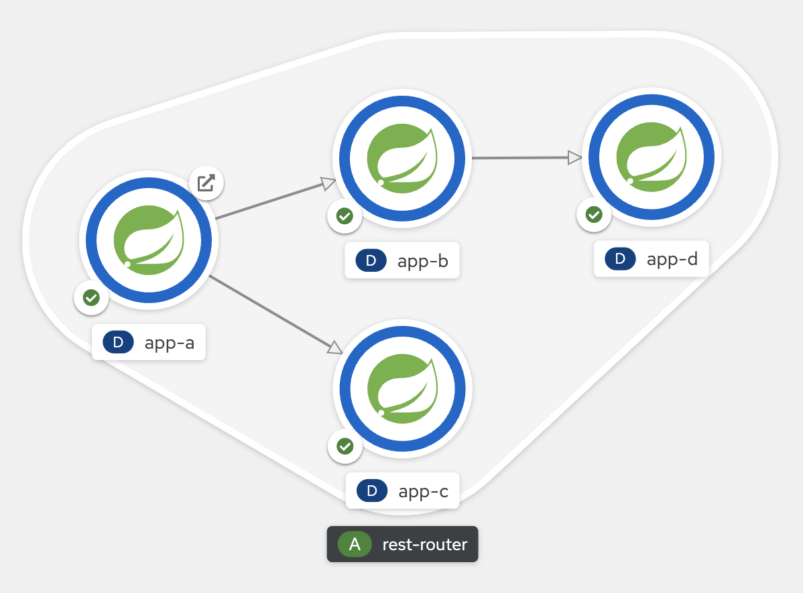

# rest-router Project

This project is used to create a bunch of microservices that call between each other for testing puposes in OpenShift.

Take a look at [mesh file](mesh/mesh.md) for OCP Service Mesh test.

## Configuration

Done via Environment Variables:

- **APP_NAME**: PostgreSQL host url
- **APP_ROUTING_DESTINATION**: Comma separated routes to call (ex: application-b/route,application-c/route)

## API Documentation & Other Tools

API calls:

- Call routing service [GET]: `/route`. Example:
  ```sh
  curl -X GET http://localhost:8080/route
  ```

## Run in Openshift

Use following commands to deploy this model:



```sh
# Create project
oc new-project rest-routing-test

# Create image builder
oc new-build \
  --name rest-router \
  openshift/ubi8-openjdk-11:1.3~https://github.com/clbartolome/spring-rest-router \
  -n rest-routing-test

# Build image
oc start-build rest-router

# Deploy A
oc new-app --name app-a \
  -i rest-routing-test/rest-router:latest \
  -e APP_NAME=app-a \
  -e APP_ROUTING_DESTINATION=http://app-b:8080/route,http://app-c:8080/route \
  -e APP_VERSION=v1 \
  -n rest-routing-test

oc expose svc app-a

oc label deploy app-a \
  app.kubernetes.io/part-of=rest-router \
  app.openshift.io/runtime=spring \
  -n rest-routing-test
oc annotate deploy app-a app.openshift.io/connects-to='[{"apiVersion":"apps/v1","kind":"Deployment","name":"app-b"},{"apiVersion":"apps/v1","kind":"Deployment","name":"app-c"}]' -n rest-routing-test

# Deploy B
oc new-app --name app-b \
  -i rest-routing-test/rest-router:latest \
  -e APP_NAME=app-b \
  -e APP_ROUTING_DESTINATION=http://app-d:8080/route \
  -e APP_VERSION=v1 \
  -n rest-routing-test

oc label deploy app-b \
  app.kubernetes.io/part-of=rest-router \
  app.openshift.io/runtime=spring \
  -n rest-routing-test
oc annotate deploy app-b app.openshift.io/connects-to='[{"apiVersion":"apps/v1","kind":"Deployment","name":"app-d"}]' -n rest-routing-test

# Deploy C
oc new-app --name app-c \
  -i rest-routing-test/rest-router:latest \
  -e APP_NAME=app-c \
  -e APP_ROUTING_DESTINATION= \
  -n rest-routing-test

oc label deploy app-c \
  app.kubernetes.io/part-of=rest-router \
  app.openshift.io/runtime=spring \
  -n rest-routing-test

# Deploy D
oc new-app --name app-d \
  -i rest-routing-test/rest-router:latest \
  -e APP_NAME=app-d \
  -e APP_ROUTING_DESTINATION= \
  -n rest-routing-test

oc label deploy app-d \
  app.kubernetes.io/part-of=rest-router \
  app.openshift.io/runtime=spring \
  -n rest-routing-test
```

## Run Locally

```sh

# Start application using Maven
mvn spring-boot:run -Dspring-boot.run.jvmArguments="-DAPP_NAME=local-router -DAPP_VERSION=v1 -Dspring.profiles.active=local -DAPP_ROUTING_DESTINATION="

# Validate
curl localhost:8080/route
```

