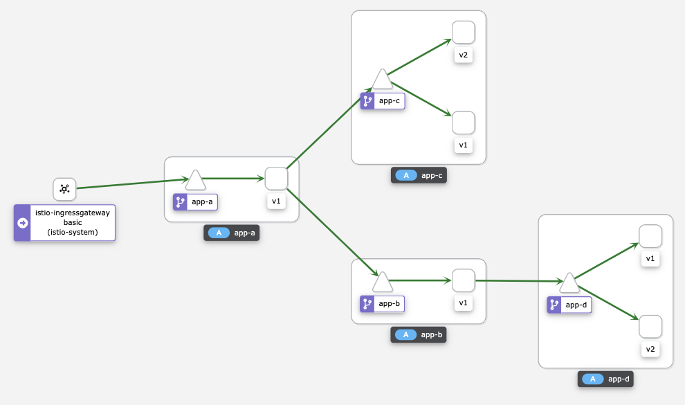

# Service Mesh



## Installation
œ
- Install the following operators:
  - OpenShift Elasticsearch
  - Red Hat OpenShift distributed tracing platform
  - Kiali
  - Red Hat OpenShift Service Mesh

- Create the mesh control plane:
  ```sh
  oc new-project istio-system

  oc create -f mesh/controlplane.yaml -n istio-system
  ```

- Get Jaeger Collector URL:
```sh
JAEGER_COLLECTOR=http://jaeger-collector.istio-system.svc:14268/api/traces
```

- Add Rest Router to the mesh:
  ```sh
  oc new-project mesh-demo
  oc create -f mesh/memberroll.yaml  -n istio-system

  oc get smmr -n istio-system -o wide
  # oc -n istio-system patch --type='json' smmr default -p '[{"op": "remove", "path": "/spec/members", "value":["'"mesh-demo"'"]}]'
  ```

- Deploy application:
  ```sh
  # Create Image
  oc new-build \
  --name rest-router \
  openshift/ubi8-openjdk-11:1.3~https://github.com/clbartolome/spring-rest-router \
  -n mesh-demo

  # Deploy A
  oc process -f mesh/app-template.yaml \
    -p APP_NAME=app-a \
    -p APP_VERSION=v1 \
    -p APP_ROUTING_DESTINATION=http://app-b:8080/route,http://app-c:8080/route \
    -n mesh-demo \
    | oc apply -f -

  # Deploy B
  oc process -f mesh/app-template.yaml \
    -p APP_NAME=app-b \
    -p APP_VERSION=v1 \
    -p APP_ROUTING_DESTINATION=http://app-d:8080/route \
    -n mesh-demo \
    | oc apply -f -

  # Deploy C (v1)
  oc process -f mesh/app-template.yaml \
    -p APP_NAME=app-c \
    -p APP_VERSION=v1 \
    -n mesh-demo \
    | oc apply -f -

  # Deploy C (v2)
  oc process -f mesh/app-template.yaml \
    -p APP_NAME=app-c \
    -p APP_VERSION=v2 \
    -n mesh-demo \
    | oc apply -f -

  # Deploy D (v1)
  oc process -f mesh/app-template.yaml \
    -p APP_NAME=app-d \
    -p APP_VERSION=v1 \
    -n mesh-demo \
    | oc apply -f -

  # Deploy D (v2)
  oc process -f mesh/app-template.yaml \
    -p APP_NAME=app-d \
    -p APP_VERSION=v2 \
    -n mesh-demo \
    | oc apply -f -

- Create the ingress gateway:
  ```sh
  oc apply -f mesh/ingressgateway.yaml

  export GATEWAY_URL=$(oc get route istio-ingressgateway -o jsonpath='{.spec.host}' -n istio-system )
  curl http://$GATEWAY_URL/route
  ```

- Create the destination rules:
  ```sh
  oc apply -f mesh/destinationrules.yaml -n mesh-demo
  ```

- Create virtual services:
  ```sh
  oc apply -f mesh/virtualservices.yaml -n mesh-demo
  ```

